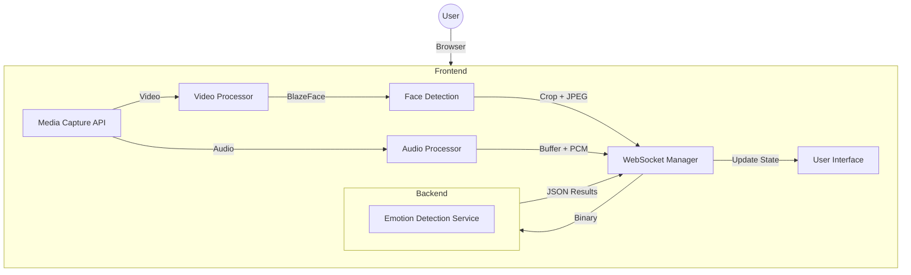

# EmotionAI Technical Architecture

This document outlines the technical architecture of the EmotionAI Next.js Frontend.

## System Overview

EmotionAI is a multimodal emotion detection system that processes video and audio in real-time. The frontend handles media capture, client-side preprocessing (face detection), and WebSocket communication with the backend.



## Data Protocol

The frontend communicates with the backend via WebSocket using a binary protocol defined in `test_frontend/app.py`.

### WebSocket Endpoint
`ws://localhost:8000/ws/stream`

### Outgoing Messages (Binary)

| Type | Header (5 bytes) | Payload |
|------|------------------|---------|
| Video Frame | `FRAME` | JPEG Image Data (Face Crop) |
| Audio Chunk | `AUDIO` | 16kHz Mono PCM Int16 Data |

### Incoming Messages (JSON)

```json
{
  "type": "result",
  "emotion": "happy",
  "confidence": 0.95,
  "timestamp": 1234567890.123
}
```

## Core Components

### 1. Face Detection (`lib/faceDetection.ts`)
- **Engine**: TensorFlow.js with BlazeFace model.
- **Logic**: 
  - Detect faces with confidence > 0.5.
  - Apply 20px padding to the bounding box.
  - Crop face region and compress as JPEG (85% quality).

### 2. Audio Processing (`lib/audioProcessor.ts`)
- **Capture**: Web Audio API (16kHz).
- **Processing**: 
  - Convert Float32 samples to Int16 PCM.
  - Maintain a 2-second circular buffer (matching test_frontend).
  - Send audio chunk every 60 video frames (approx. 2 seconds).

### 3. WebSocket Manager (`lib/websocket.ts`)
- **Type**: Singleton.
- **Features**: 
  - Automatic reconnection with exponential backoff.
  - Binary message framing.
  - Event-based architecture for results.

### 4. Upload Mode (`components/UploadMode.tsx`)
- **Logic**:
  - Decode uploaded video to extract full PCM audio track.
  - Seek through video frames at 30 FPS.
  - Process each frame through the same face detection pipeline.
  - Buffer and send audio chunks in sync with video frames.

## Technology Stack

- **Framework**: Next.js 14 (App Router)
- **Language**: TypeScript
- **Styling**: Tailwind CSS
- **Animations**: Framer Motion
- **Icons**: Lucide React
- **ML Engine**: TensorFlow.js
- **State Management**: React Hooks (useState, useRef, useEffect)

## Design System

The UI follows a **Futuristic/Cyberpunk** aesthetic:
- **Theme**: Dark mode (#0a0e27)
- **Accents**: Neon gradients (Cyan, Purple, Pink)
- **Effects**: Glassmorphism, backdrop blurs, glow shadows
- **Typography**: Inter (UI) & JetBrains Mono (Data)

## Performance Optimizations

- **Off-Main-Thread**: Face detection is done in the browser using WASM/WebGL.
- **Binary Data**: Using ArrayBuffers for transmission to reduce overhead.
- **Selective Processing**: Only face crops are sent, not the full video frame.
- **Lazy Loading**: ML models are loaded only when the application starts.
